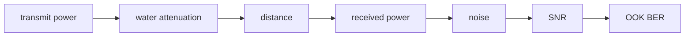

# Architecture

## Channel preset
Water condition maps to an attenuation coefficient.

## Attenuation
Beer-Lambert decay converts transmit power to received optical power.

## Noise model
Received power is compared with a configurable noise floor.

## Link metric
SNR feeds an approximate OOK bit-error-rate expression.

## Sweep
Multiple distances generate a reproducible link-budget curve.

## Design principle
A simulation should expose its physical assumptions so later hardware results can be compared against them rather than retrofitted.
